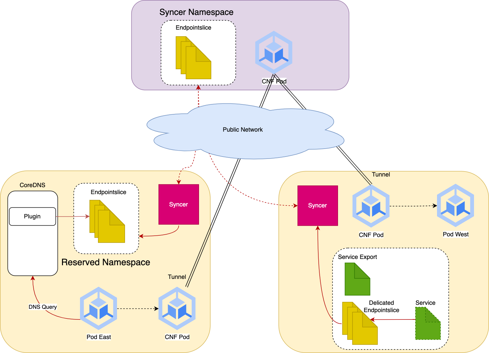

## ovn-builder

`ovn-builder` connects kubernetes clusters by a new build parallel network securely.
`ovn-builder` has no limits of cluster IP CIDR or CNI types of kubernetes clusters and also
provide service discovery ability.

It consists of several parts for networking between clusters:

- ovnmaster it builds an `ovs` for in-cluster traffic manage which is parallel with native cluster CNI and IPAM 
  for second network interface
- nri-controller add second network interface when pod created.
- syncer sync multi cluster services related resource across clusters
- octopus manages secure tunnels between hub and clusters
- crossdns provides DNS discovery of Services across clusters.

## Architecture


## Hub Cluster

We use hub cluster to exchange MCS related resources for connecting clusters, and establish secure tunnels with
all other participating clusters. Hub defines a set of ServiceAccount, Secrets and RBAC to enable `Syncer` and
`octopus`to securely access the Hub cluster's API.

## Octopus

Octopus maintains the tunnels by using of [WireGuard](https://www.wireguard.com/), a performant and secure VPN
in`CNF pod`. The `CNF pod` can run on any node without specifically designated. `CNF pod` will generate key pairs 
every time it starts, creates and up wiregurad network interface and config the wireguard device with `peer` CRD.


For develop guide, workflow show as.


## Syncer、Cross DNS

We may merge the two components into one Service Discovery Component.

For every service in cluster which has ServiceExport created for it. A new EndpointSlice will be generated to represent
the running pods contain references to endpoint's secondary IP. These endpointSlice resources will be exported to
`Hub Cluster` and will be copied to other clusters.



## OvnMaster

OvnMaster deploy `OVN/OVS` components to create a virtual switch for all pods’ secondary network, so that we can route
all inner cluster traffic to CNF pod in L2 level, without any specifically modification on Kubernetes Node.

Also, it creates logical switch, watches the Pod creation and deletion events, manage the address and create
logical ports. Finally, it writes the assigned address to the annotation of the Pod.


## Helm Chart Installation

`Nauti` is pretty easy to install with `Helm`. Make sure you already have at least 2 Kubernetes clusters, 
please refer to this installation guide.

### Set Global CIDR
`Global CIDR` is used in parallel network connection, it should not be conflict or overlap with cluster `Pod`
or `Service` CIDR, it's `10.112.0.0/12` by default.

### Install in Hub
`Hub` is a kubernetes which has a public IP exposed,
  ```shell
  $ helm repo add  mcs http://122.96.144.180:30088/charts/mcs
  "mcs" has been added to your repositories
  $ helm repo list
  NAME    URL
  mcs     http://122.96.144.180:30088/charts/mcs
  $ helm search repo mcs
  NAME                    CHART VERSION   APP VERSION     DESCRIPTION
  mcs/octopus             0.1.0           1.16.0          A Helm chart for Tunnel across clusters.
  mcs/octopus-agent       0.1.0           1.0.0           A Helm chart for Tunnel across clusters.
  $ helm install octopus mcs/octopus --namespace octopus-system  --create-namespace \
  --set tunnel.endpoint=xx.xx.xx.xx --set tunnel.cidr=10.112.0.0/12
  NAME: kube-ovn
  LAST DEPLOYED: Fri Mar 31 12:43:43 2024
  NAMESPACE: octopus-system
  STATUS: deployed
  REVISION: 1
  TEST SUITE: None
  
  Thank you for installing octopus.
  Your release is named octopus.

  Continue to install octopus-agent on clusters, with ca and token:
  export HUB_CA=$(kubectl -n octopus-system get secrets \
  -o jsonpath="{.items[?(@.metadata.annotations['kubernetes\.io/service-account\.name']=='octopus')].data['ca\.crt']}")

  export HUB_TOKEN=$(kubectl -n octopus-system  get secrets \
    -o jsonpath="{.items[?(@.metadata.annotations['kubernetes\.io/service-account\.name']=='octopus')].data.token}")
  And install octopus-agent in cluster by:
  
  helm install octopus-agent mcs/octopus-agent --namespace octopus-system  --create-namespace \
  --set hub.hubURL=https://xx.xx.xx.xx:6443 --set hub.ca=$HUB_CA --set hub.token=$HUB_TOKEN
   --set tunnel.cidr=10.113.0.0/16 --set cluster.clusterID=cluster1
  ```
  After the installation, some install guide scripts will print in standard output. Get HUB_CA and HUB_TOKEN in
  `Hub cluster`.
  ```shell
  export HUB_CA=$(kubectl -n octopus-system get secrets \
  -o jsonpath="{.items[?(@.metadata.annotations['kubernetes\.io/service-account\.name']=='octopus')].data['ca\.crt']}")

  export HUB_TOKEN=$(kubectl -n octopus-system  get secrets \
    -o jsonpath="{.items[?(@.metadata.annotations['kubernetes\.io/service-account\.name']=='octopus')].data.token}")
  ```


### Install in Cluster
  Add a PV (Be careful, the PV below is just for demo):
  ```yaml
  apiVersion: v1
  kind: PersistentVolume
  metadata:
    name: ovn-pv
  spec:
    capacity:
      storage: 1Gi
    volumeMode: Filesystem
    accessModes:
    - ReadWriteOnce
    persistentVolumeReclaimPolicy: Retain
    storageClassName: local-storage
    local:
      path: /home/ubuntu/pv
    nodeAffinity:
      required:
        nodeSelectorTerms:
        - matchExpressions:
          - key: kubernetes.io/hostname
            operator: In
            values:
            - child-node-0
  ```
  ``` shell
  $ kubectl create -f local-pv.yaml
  ```
  Setup environment variables we will need later for joining clusters.
  ```shell
    $ export HUB_CA=$HUB_CA # the HUB CA get from Hub cluster.
    $ export HUB_TOKEN=$HUB_TOKENN # the HUB TOKEN get from Hub cluster.
  ```

  Joining a cluster, make sure clusterID and tunnel.cidr is unique. We don't require cluster has a public IP.
  ```shell
  $ helm repo add  mcs http://122.96.144.180:30088/charts/mcs
  "mcs" has been added to your repositories
  
  $ helm install octopus-agent mcs/octopus-agent --namespace octopus-system  --create-namespace   \
  --set hub.hubURL=https://xx.xx.xx.xx:6443   --set tunnel.globalcidr=10.112.0.0/12 --set hub.ca=$HUB_CA \
  --set hub.token=$HUB_TOKEN --set tunnel.cidr=10.113.0.0/16 --set cluster.clusterID=cluster0
  ```
  Add cross cluster DNS config segment, in `coredns` configmap, and restart coredns pods.
  ```yaml
    hyperos.local:53 {
        forward . 10.96.0.11
     }
  ```
  ```shell
  $ kubectl delete pod -n kube-system --selector=k8s-app=kube-dns
  ```
  
### Test examples:
  Create this example in one cluster.
  ```shell
  $ kubectl create -f https://raw.githubusercontent.com/nauti-io/nauti/main/examples/nginx-deploy.yaml
  ```
  Test it in another cluster.
  ```shell
  $ kubectl exec -it nginx-app-xxx  -c alpine -- curl nginx-svc.default.svc.hyperos.local
  <!DOCTYPE html>
  <html>
  <head>
  <title>Welcome to nginx!</title>
  <style>
      body {
          width: 35em;
          margin: 0 auto;
          font-family: Tahoma, Verdana, Arial, sans-serif;
      }
  </style>
  </head>
  <body>
  <h1>Welcome to nginx!</h1>
  <p>If you see this page, the nginx web server is successfully installed and
  working. Further configuration is required.</p>
  
  <p>For online documentation and support please refer to
  <a href="http://nginx.org/">nginx.org</a>.<br/>
  Commercial support is available at
  <a href="http://nginx.com/">nginx.com</a>.</p>
  
  <p><em>Thank you for using nginx.</em></p>
  </body>
  </html>
  ```
## Clear All
  ```shell
  $ helm uninstall octopus -n octopus-system
  $ kubectl delete -f local-pv.yaml
  $ kubectl delete ns octopus-system
  $ for ns in $(kubectl get ns -o name |cut -c 11-); do
      echo "annotating pods in  ns:$ns"
      kubectl annotate pod --all ovn.kubernetes.io/cidr- -n "$ns"
      kubectl annotate pod --all ovn.kubernetes.io/gateway- -n "$ns"
      kubectl annotate pod --all ovn.kubernetes.io/ip_address- -n "$ns"
      kubectl annotate pod --all ovn.kubernetes.io/logical_switch- -n "$ns"
      kubectl annotate pod --all ovn.kubernetes.io/mac_address- -n "$ns"
      kubectl annotate pod --all ovn.kubernetes.io/allocated- -n "$ns"
      kubectl annotate pod --all ovn.kubernetes.io/pod_nic_type- -n "$ns"
      kubectl annotate pod --all ovn.kubernetes.io/routes- -n "$ns"
    done
  ```

